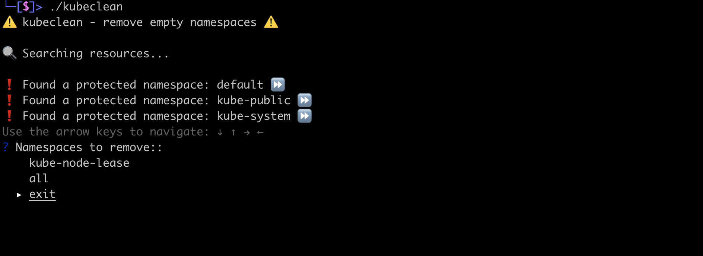

# K8s namespace clean
Tool to remove empty namespaces on kubernetes

:warning: Do not run with a kubeconfig with role cluster-admin!

## Overview

## Requirements
* Go +1.15.2
* kubectl installed
* valid kubeconfig

## Installation 

### using go get   
`$ go get github.com/edsoncelio/kubeclean`

### from source
TODO

## Usage   
`$ kubeclean`

# Documentation
TODO

# TODO
 - [ ] add documentation
 - [ ] add tests
 - [x] check for deployment
 - [x] check for service
 - [x] check for statefulset
 - [ ] check for secret (beyond default)
 - [ ] check for service account (beyond default)
 - [ ] use external file to namespace exceptions (system namespaces)
 - [x] create the help flag
 - [x] configure CI (with github actions)
 - [x] configure release
 
